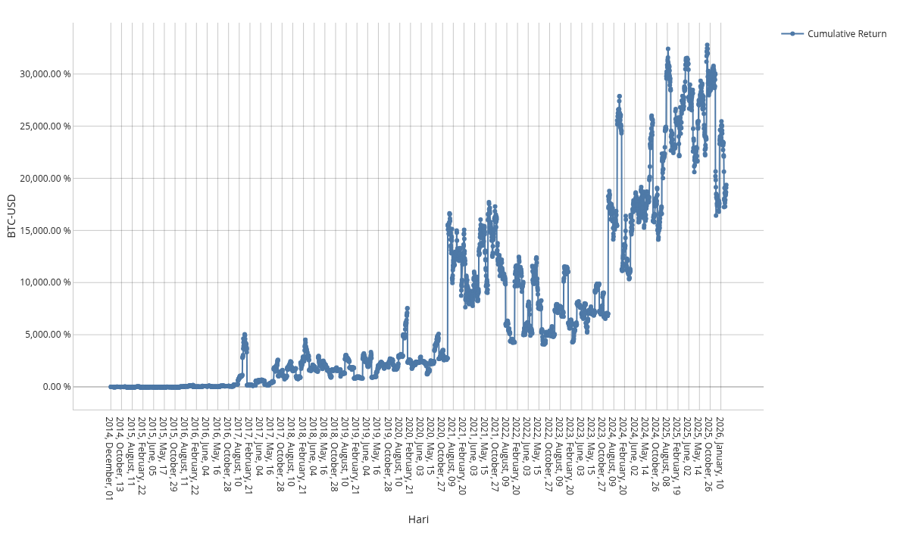
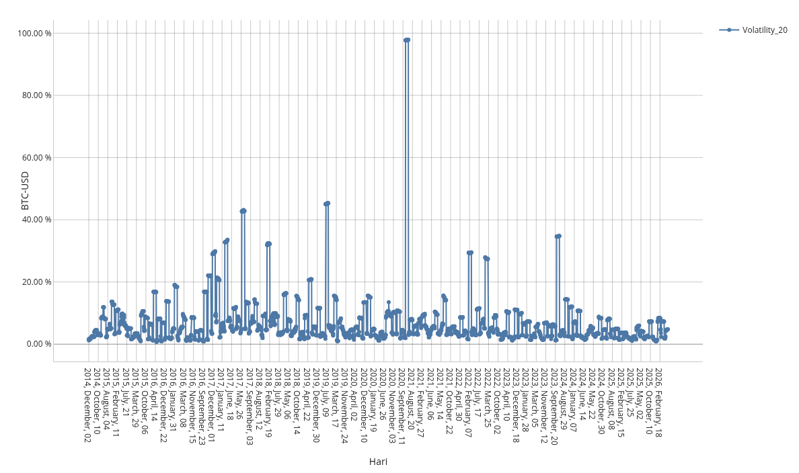
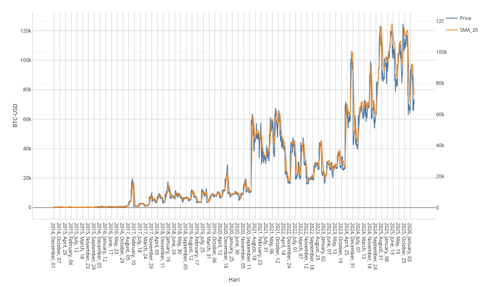
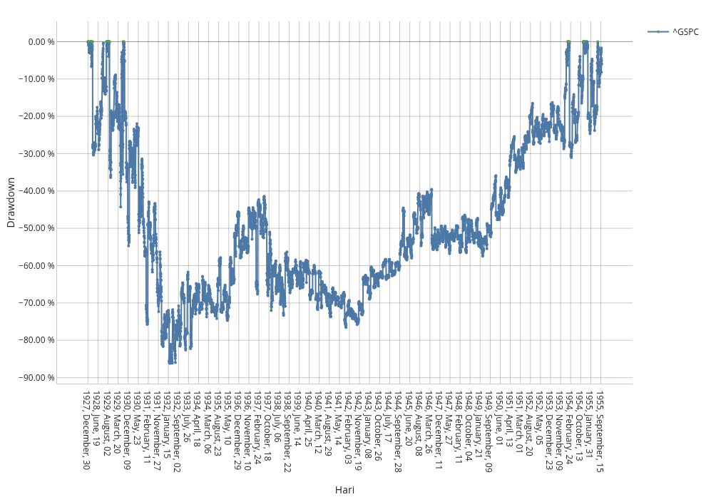
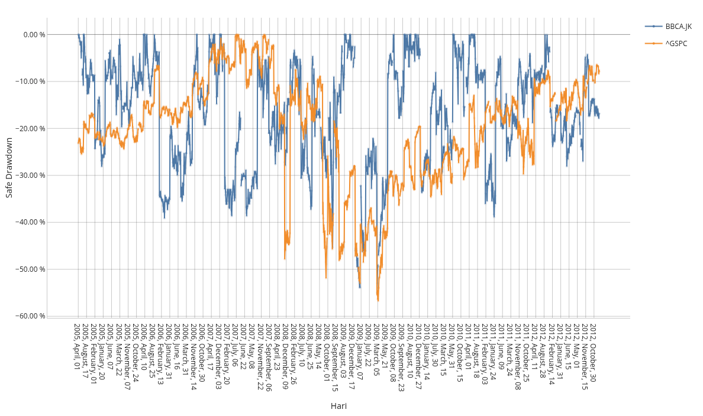

# 📈 20 Asset Market Cube - Analisis Multi-Aset dengan Atoti

Proyek ini menggunakan **Atoti** untuk membuat kubus data (data cube) interaktif dari 20 instrumen keuangan berbeda. Data historis ditarik dari **Yahoo Finance** menggunakan `yfinance`, mencakup periode dari tahun **1927 hingga sekarang**.

Tujuan dari analisis ini adalah untuk memahami perilaku berbagai kelas aset (Saham, Komoditas, Kripto, Indeks) melalui metrik seperti *return* harian, *return* kumulatif, *drawdown*, dan volatilitas.

## 🛠️ Teknologi yang Digunakan

- **Python:** `pandas`, `yfinance`
- **Analisis Multidimensi:** `atoti`
- **Penyimpanan Data:** `.feather` (format biner cepat)

---

## 📊 Data yang Digunakan (20 Instrumen)

Data terdiri dari harga *closing* harian. Berikut adalah daftar lengkap instrumen yang dianalisis beserta kategori dan alasan pemilihannya:

| Kategori                     | Simbol      | Nama Instrumen                          | Alasan Pengambilan                                                     |
| :--------------------------- | :---------- | :-------------------------------------- | :--------------------------------------------------------------------- |
| **Komoditas**          | `GC=F`    | Gold (Emas)                             | Sebagai*safe haven* dan lindung nilai inflasi.                       |
|                              | `SI=F`    | Silver (Perak)                          | Komoditas industri dan logam mulia.                                    |
|                              | `CL=F`    | Crude Oil (Minyak Mentah)               | Barometer utama aktivitas ekonomi global.                              |
|                              | `NG=F`    | Natural Gas (Gas Alam)                  | Komoditas energi penting untuk listrik dan industri.                   |
|                              | `HG=F`    | Copper (Tembaga)                        | Dijuluki "Dr. Copper" karena indikator kesehatan ekonomi.              |
| **Kripto**             | `BTC-USD` | Bitcoin                                 | Sebagai perwakilan aset digital dengan volatilitas tinggi.             |
| **Saham Teknologi**    | `NVDA`    | NVIDIA                                  | Barometer AI dan semikonduktor.                                        |
|                              | `AAPL`    | Apple                                   | Raksasa teknologi dengan kapitalisasi pasar terbesar.                  |
|                              | `MSFT`    | Microsoft                               | Pemimpin di bidang software dan cloud.                                 |
|                              | `TSLA`    | Tesla                                   | Pelopor kendaraan listrik (EV).                                        |
|                              | `GOOGL`   | Alphabet (Google)                       | Dominan di sektor iklan digital dan teknologi.                         |
| **Saham Indonesia**    | `BBCA.JK` | Bank BCA                                | Saham perbankan dengan kapitalisasi terbesar di Indonesia.             |
|                              | `BBRI.JK` | Bank BRI                                | Terbesar di sektor mikrofinance.                                       |
|                              | `TLKM.JK` | Telkom Indonesia                        | BUMN telekomunikasi dominan.                                           |
|                              | `ASII.JK` | Astra International                     | Konglomerat dengan portofolio terdiversifikasi (otomotif, alat berat). |
| **Indeks & Mata Uang** | `^GSPC`   | S&P 500                                 | Indeks acuan pasar saham AS.                                           |
|                              | `^JKSE`   | IDX Composite (IHSG)                    | Indeks acuan pasar saham Indonesia.                                    |
|                              | `^IXIC`   | NASDAQ Composite                        | Indeks berbobot teknologi tinggi.                                      |
|                              | `IDR=X`   | IDR/USD                                 | Nilai tukar Rupiah terhadap Dolar AS.                                  |
|                              | `^TNX`    | CBOE Interest Rate 10 Year T No (Yield) | Imbal hasil obligasi AS 10 tahun, indikator suku bunga.                |

---

## 📈 Analisis dan Visualisasi

### 1. Pergerakan Harian

**Daily Return** dihitung untuk melihat fluktuasi harga harian dalam persentase.

- **Insight:** Dari data ini, terlihat bahwa pergerakan harga Bitcoin paling ekstrim terjadi pada **1 April 2021**.

### 2. Return Kumulatif

Menghitung keuntungan secara kumulatif sejak data pertama kali tersedia untuk setiap instrumen.

- **Insight:** Grafik ini membandingkan pertumbuhan investasi jangka panjang antar aset, menunjukkan efek *compound interest* dan pertumbuhan eksponensial pada aset berisiko tinggi seperti saham teknologi dan kripto.

### 3. Volatilitas (20 Hari)

Volatilitas dihitung menggunakan standar deviasi dari *daily return* dalam 20 hari terakhir untuk mengukur tingkat risiko dan ketidakstabilan harga.

- **Insight:** Volatilitas Bitcoin mencapai puncaknya selama periode **2020 hingga 2021**, seiring dengan gejolak pasar selama pandemi dan bull run kripto.

### 4. Filter dengan Simple Moving Average (SMA 20)

Karena harga *close* pasar penuh dengan *noise*, digunakan **Simple Moving Average (SMA) 20 hari** untuk menghaluskan fluktuasi dan melihat tren yang lebih jelas.

### 5. Analisis Krisis: Great Depression (1927-1955)

**Pertanyaan:** Berapa lama waktu yang dibutuhkan S&P 500 untuk pulih ke titik nol setelah kehancuran tahun 1929?

- **Analisis Drawdown:** Metrik *drawdown* menunjukkan penurunan dari titik tertinggi sebelumnya (*peak*).
- **Insight:** S&P 500 mengalami penurunan sekitar **85%** dari puncaknya dan membutuhkan waktu sekitar **25 tahun** untuk sepenuhnya pulih ke level tertinggi sebelumnya (Breakeven).

### 6. Analisis Krisis: Subprime Mortgage (2005-2010)

**Pertanyaan:** Bagaimana daya tahan saham Indonesia (BBCA) dibandingkan pasar global (S&P 500) saat krisis 2008?

- **Insight:** Grafik berikut membandingkan BBCA.JK dan ^GSPC. Terlihat bahwa meskipun sama-sama terdampak, **BBCA.JK relatif lebih cepat pulih** dan mengalami *drawdown* yang tidak sedalam S&P 500 selama periode krisis keuangan global.

---

## 🚀 Cara Menjalankan

1. Clone repository ini.
2. Install dependencies: `pip install yfinance pandas atoti pyarrow`
3. Jalankan ulang notebook `20_Asset_Market_Cube.ipynb` untuk membuat session Atoti dan mengexplore data secara interaktif.

## Kontributor

Rafael H - 166
